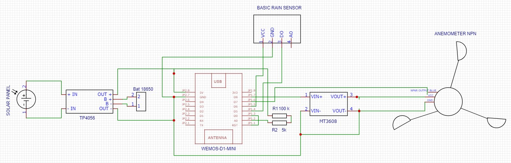

# Description
Anemometer and rain detector with Wemos D1 Mini (ESP8266). Powered by a 18650 battery and solar panels. The values are sent to a MQTT server every minute. The wemos d1 mini turns to deep sleep to save power.

# Bill of materials
- Wemos d1 mini
- MT3608 DC-DC Step Up
- Rain detector
- Anemometer NPN DC5-30V
- Solar panels 2*1W 5V
- Battery 18650 3500mAh
- TP4056 Li-lon Battery Charger
- 100 k ohms resistor
- Jumper wires

# Wiring

**Battery monitoring**: the voltage of an 18650 battery is 3.7V and can go up to 4.2V when it is fully charged. 
The Wemos D1 mini already has an internal voltage divider that connects the A0 pin to the ADC of the ESP8266 chip. This is a 220 k resistor over 100 k resistor. By adding a 100k resistor, it will in fact be a total of 420 k. So the ADC of the ESP8266 would get 4.2 * 100 / 420 = 1V with a fully charged 18650. 1V is the max input to the ADC and will give a raw reading of 1023. We consider that the battery is 0% when the voltage 3.3V. With the resistors the ESP8266 will get about 0.8V (3.3 * 100 / 420), which correspond to a raw reading of 820 (0.8 * 1 023).

**Anemometer**: it's powered by the D8 pin of the Wemos D1 Mini only during the measurement. As the output voltage of the Wemos D1 Mini is 3.3V and the anemometer needs at least 5V, an MT3608 is used to step up the voltage to 5V. The specifications of the anemometer state that 20 impulses per second are equal to 1.75 m/s.

**Rain detector**: it's powered by the D6 pin of the Wemos D1 Mini only during the measurement. The potentiometer is calibrated by turning the screw. Counterclockwise for increased sensitivity.

# Sources
- https://arduinodiy.wordpress.com/2016/12/25/monitoring-lipo-battery-voltage-with-wemos-d1-minibattery-shield-and-thingspeak/
- https://github.com/StationMeteoDIY/anemometre/tree/main
- https://how2electronics.com/interfacing-anemometer-npn-pulse-output-with-arduino/
- https://lastminuteengineers.com/rain-sensor-arduino-tutorial/

